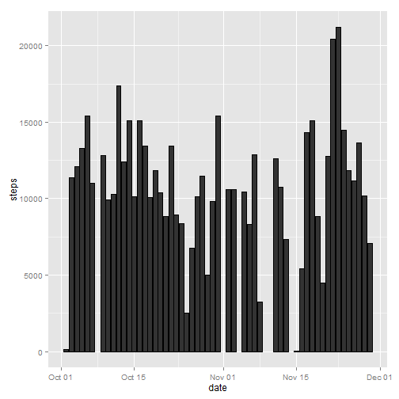
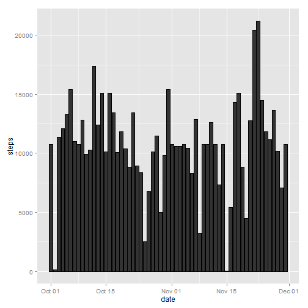
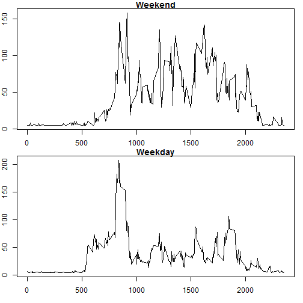

#Reproducible Research: Peer Assessment 1
=========================================

#Loading and preprocessing the data

```r
setwd("D:/Coursera/201504 - Reproducible Research/Data")
library(ggplot2)
data_raw <- read.csv('activity.csv',colClasses=c('numeric','factor', 'numeric'))
data_raw$date <- as.Date(data_raw[,2], format="%Y-%m-%d")
good <- complete.cases(data_raw["steps"])
df1 <- data_raw[good,]
date<- data.frame(Row=1:53,Date=c(unique(df1$date)))
```

#What is mean total number of steps taken per day?
1. Make a histogram of the total number of steps taken each day

```r
step                  <- by(df1$steps, df1$date, sum)
date_step             <- data.frame(date=date[,2], steps=c(step))
row.names(date_step)  <- NULL

ggplot(data=date_step, aes(x=date, y=steps)) +
  geom_bar(stat="identity", position=position_dodge(), colour="black")
```

 

2. Calculate and report the mean and median of the total number of steps taken per day

```r
mean(step)
```

```
## [1] 10766.19
```

```r
median(step)
```

```
## 2012-11-12 
##      10765
```
The mean is 10766 steps per day.
The median is 10765 steps per day.

#What is the average daily activity pattern?

Make a time series plot (i.e. type = "l") of the 5-minute interval (x-axis) and the average number of steps taken, averaged across all days (y-axis)

```r
time <- data.frame(Row=1:288,period=c(unique(df1$interval)))
step2 <- by(df1$steps, df1$interval, mean)
time_step <- data.frame(interval=time[,2], steps=c(step2))
row.names(time_step)  <- NULL
plot(  x=time_step$interval
       ,y=time_step$steps
       ,type="l"
       ,xlab="Interval"
       ,ylab="Average Steps"
)
```

 

Which 5-minute interval, on average across all the days in the dataset, contains the maximum number of steps?

```r
time_step[which.max(time_step$steps), ]
```

```
##     interval    steps
## 104      835 206.1698
```
The time interval at 835 contains the maximum number of steps (206.17 steps)

#Imputing missing values

Note that there are a number of days/intervals where there are missing values (coded as NA). The presence of missing days may introduce bias into some calculations or summaries of the data.

1. Calculate and report the total number of missing values in the dataset (i.e. the total number of rows with NAs)

```r
sapply(data_raw, function(x) sum(is.na(x)))
```

```
##    steps     date interval 
##     2304        0        0
```


2. Devise a strategy for filling in all of the missing values in the dataset. The strategy does not need to be sophisticated. For example, you could use the mean/median for that day, or the mean for that 5-minute interval, etc.

Create a new dataset that is equal to the original dataset but with the missing data filled in.


```r
df1_r <- data_raw

x <- for(i in 1:ncol(df1_r)){
  df1_r[is.na(df1_r[,i]), i] <- mean(df1_r[,i], na.rm = TRUE) }

date_r                  <- data.frame(Row=1:61,Date=c(unique(df1_r$date)))
step_r                  <- by(df1_r$steps, df1_r$date, sum)
date_step_r             <- data.frame(date=date_r[,2], steps=c(step_r))
row.names(date_step_r)  <- NULL
```
For the sake of simplicity, the NA values would just be replaced by the average steps every 5 minutes during the two months.


3. Make a histogram of the total number of steps taken each day and Calculate and report the mean and median total number of steps taken per day. Do these values differ from the estimates from the first part of the assignment? What is the impact of imputing missing data on the estimates of the total daily number of steps?

```r
ggplot(data=date_step_r, aes(x=date, y=steps)) +
  geom_bar(stat="identity", position=position_dodge(), colour="black")
```

 

The histogram, as a result, is similar to the one we had before.

```r
mean(step_r)
```

```
## [1] 10766.19
```

```r
median(step_r)
```

```
## 2012-11-04 
##   10766.19
```
Because we substituted the NAs with average steps, the mean and median remains the same (almost).


#Are there differences in activity patterns between weekdays and weekends?

```r
date_day_r <- data.frame(date=df1_r$date,day=weekdays(df1_r$date))
day_step_r <- data.frame(cbind(date_day_r,steps=df1_r$steps,interval=df1_r$interval))

weekday <- c("Monday","Tuesday","Wednesday","Thursday","Friday")
weekend <- c("Saturday","Sunday")

step_weekday <- day_step_r[day_step_r$day %in% weekday,]
step_weekend <- day_step_r[day_step_r$day %in% weekend,]

step_weekday_avg <- by(step_weekday$steps, step_weekday$interval, mean)
step_weekend_avg <- by(step_weekend$steps, step_weekend$interval, mean)

data_weekday_r <- data.frame(cbind(interval=time$period,step_avg=step_weekday_avg))
row.names(data_weekday_r)  <- NULL

data_weekend_r <- data.frame(cbind(interval=time$period,step_avg=step_weekend_avg))
row.names(data_weekend_r)  <- NULL

par(mfrow = c(2, 1), mar = c(2, 1, 1, 1), oma = c(1, 1, 0, 0))

plot(  x=data_weekend_r$interval
       ,y=data_weekend_r$step_avg
       ,type="l"
       ,xlab="Interval"
       ,ylab="Steps"
       ,main="Weekend"
)

plot(  x=data_weekday_r$interval
       ,y=data_weekday_r$step_avg
       ,type="l"
       ,xlab="Interval"
       ,ylab="Steps"
       ,main="Weekday"       
)
```

 


We note that the average steps taken is lower during the typical morning rush hour during the weekends. Presumably, one spends more time walking to work during the weekdays.

However, average taken is higher after the morning rush hour on the weekends presumably one spends more time outdoors as opposed to sitting in the office during working hours on a typical weekday. The data also showed steps taken is higher for the rest of the day during the weekend as compared to a weekday.


